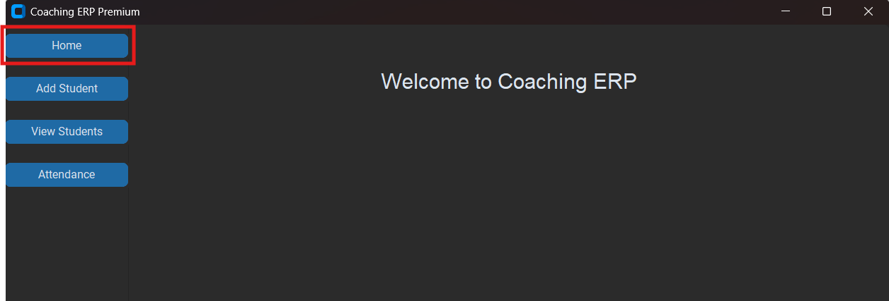
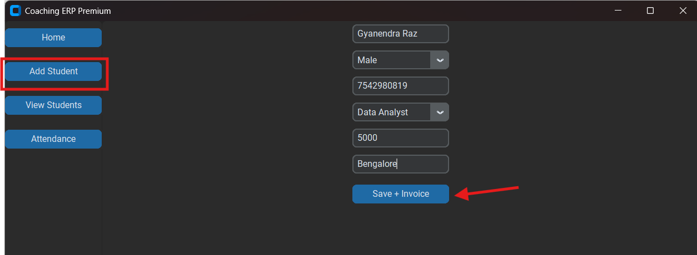
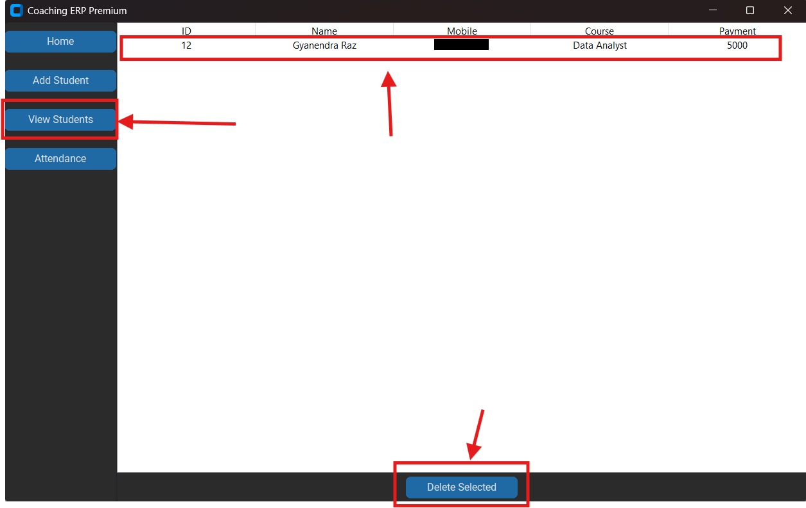
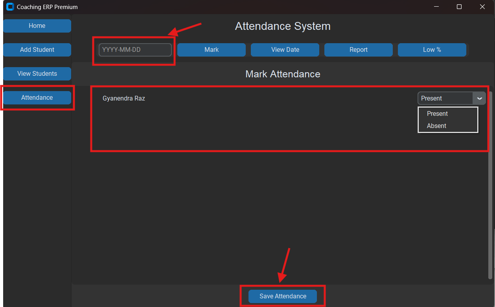

# Coaching ERP System

A premium Coaching ERP System built using Python, CustomTkinter, SQLite, and ReportLab.

---

## Features

✅ Student Management  
✅ Attendance System  
✅ Invoice PDF Generator  
✅ SQLite Database  
✅ Premium Dark UI  
✅ Student Analytics  
✅ Delete Student Option  

---

## Technologies Used

- Python
- CustomTkinter
- SQLite3
- Matplotlib
- ReportLab

---

# Screenshots

## Home Page



---

## Add Student



---

## View Students



---

## Attendance System



---

# How to Run

```bash
pip install -r requirements.txt
python main.py
